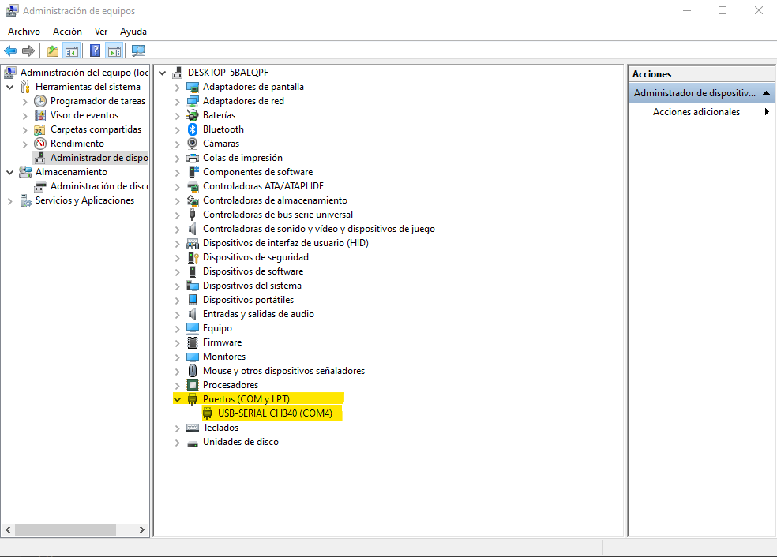

MicroByte is a hand-held and open-source retro-console powered by the ESP32-WROVER. The firmware included on this repository, is focused on achieve a modular architecture to simplify the usage and allow add easily modifications.

(**If you're lookig for general information of this project, please visit the next link: [GitHub microByte](https://github.com/jfm92/microByte)**)

The basic architecture of the software is shown in the next diagram:

// add diagram

If you want to test or modify this software you need to do the following steps.

# Development enviorement:

This software was developed using ESP-IDF which is the development environment for Espressif MCU's. The next steps will show the most compatible development set-up for this project.

You can also use the development set-up explained on the Espressif guides, but it could give some problems once you try to compile the project.

- [ESP-IDF Set-Up](https://docs.espressif.com/projects/esp-idf/en/latest/esp32s2/get-started/index.html)

## What you need:

### Hardware:

- microByte console.
- USB type C to type A cable.
- PC with Windows 10 or Linux. (macOS should work but it wasn't tested).

### Software:

#### Linux:

- Ubuntu 18.04 (Ubuntu 20.04 also works but give some problems with Python2.5)
- [Visual Studio Code](https://code.visualstudio.com).

#### Windows:

- Windows 10 version 1903 or higher.
- [Visual Studio Code](https://code.visualstudio.com).
- [WSL1](https://docs.microsoft.com/en-us/windows/wsl/install-win10) (Windows Subsystem for Linux)
- [Ubuntu 18.04 LTS for WSL](https://www.microsoft.com/store/productId/9N9TNGVNDL3Q).
- [Windows Terminal](https://www.microsoft.com/store/productId/9N0DX20HK701)

## Get ESP-IDF:

When you're using WSL in Windows you're running Linux natively on Windows, so the dependencies are the same on both O.S. because basically we're using the same O.S.

Open a terminal (Windows terminal in Windows) and execute the next commands to install the ESP-IDF dependencies:

```console
sudo apt-get update

sudo apt-get install git wget flex bison gperf python python-pip python-setuptools cmake ninja-build ccache libffi-dev libssl-dev dfu-util
```

Create workspace folder.

### Windows

To have the possibility of managing these files directly from Windows interface I recommend placing the workspace folder on the mounted folder.

```console
mkidr /mnt/c/Users/<user_name>/Documents/esp-ws
cd /mnt/c/Users/<user_name>/Documents/esp-ws
```

This give you access to the workspace throught the Documents folder of Windows.

Download ESP-IDF version 4.1.
```console
git clone https://github.com/espressif/esp-idf -b v4.1
```

Install the ESP-IDF
```console
cd /mnt/c/Users/<user_name>/Documents/esp-ws/esp-idf
./install.sh
. ./export.sh
```

Note: Each time you open a new terminal you need to reinstall the ESP-IDF, but the process only takes a few seconds.

### Linux

```console
mkidr ~/esp-ws
cd ~/esp-ws
```


Download ESP-IDF version 4.1.
```console
git clone https://github.com/espressif/esp-idf -b v4.1
```

Install the ESP-IDF
```console
cd ~/esp-ws/esp-idf
./install.sh
. ./export.sh
```

Note: Each time you open a new terminal you need to reinstall the ESP-IDF, but the process only takes a few seconds.


## Build:

On the same previous console execute the next commands.

Note: It's the same process for both O.S.

```console
git clone https://github.com/jfm92/microByte_firmware --recursive
```

To build type the next commands:
```console
cd microByte_firmware
make -j4
```

The build process could take a few minutes. If everything goes fine it should return the next output:

```console
Generating esp32.project.ld
LD build/microByte.elf
esptool.py v2.9-dev
To flash all build output, run 'make flash' or:
python /mnt/c/Users/microByte/Documents/wsl_workspace/esp-idf/components/esptool_py/esptool/esptool.py --chip esp32 --port /dev/ttyS4 --baud 2000000 --before default_reset --after hard_reset write_flash -z --flash_mode dio --flash_freq 80m --flash_size detect 0xd000 /mnt/c/Users/microByte/Documents/wsl_workspace/esp_ws/projects/microbyte/build/ota_data_initial.bin 0x1000 /mnt/c/Users/microByte/Documents/wsl_workspace/esp_ws/projects/microbyte/build/bootloader/bootloader.bin 0x10000 /mnt/c/Users/microByte/Documents/wsl_workspace/esp_ws/projects/microbyte/build/microByte.bin 0x8000 /mnt/c/Users/microByte/Documents/wsl_workspace/esp_ws/projects/microbyte/build/partitions.bin
```

Now your binary is compiled and ready to be flash.

Don't close this console, because it will use previous points indications.

## Flash:

Before flash the device, you need to connect the USB cable, turn on the microByte device and get the serial port assigned to the device.

Each O.S. is slightly different:

### Windows:

On the search box, type: Device Manager.

You will see something like the next image.



In this image you can see that the device is connected to COM4 (Highlighted in yellow), so on the WSL the device will be **/dev/ttyS4**

Type the next command on the previous terminal to start the flash process:

```console
make -j12 flash ESPPORT=/dev/ttyS4 ESPBAUD=2000000
````
ESPPORT: Is the serial port which is connected the device.
ESPBAUD: Flash baud rate. By default, we set the highest possible 2MBit

If everything goes fine, it should return the next output:

```console
App "microByte" version: 2c8dc71
Flashing binaries to serial port /dev/ttyS4 (app at offset 0x10000)...
esptool.py v2.9-dev
Serial port /dev/ttyS4
Connecting....
Chip is ESP32D0WDQ5 (revision 3)
Features: WiFi, BT, Dual Core, 240MHz, VRef calibration in efuse, Coding Scheme None
Crystal is 40MHz
MAC: 40:f5:20:49:04:54
Uploading stub...
Running stub...
Stub running...
Changing baud rate to 2000000
Changed.
Configuring flash size...
Auto-detected Flash size: 16MB
Compressed 8192 bytes to 31...
Wrote 8192 bytes (31 compressed) at 0x0000d000 in 0.0 seconds (effective 29534.5 kbit/s)...
Hash of data verified.
Compressed 26288 bytes to 16373...
Wrote 26288 bytes (16373 compressed) at 0x00001000 in 0.1 seconds (effective 1820.2 kbit/s)...
Hash of data verified.
Compressed 1527120 bytes to 623923...
Wrote 1527120 bytes (623923 compressed) at 0x00010000 in 12.7 seconds (effective 963.8 kbit/s)...
Hash of data verified.
Compressed 3072 bytes to 140...
Wrote 3072 bytes (140 compressed) at 0x00008000 in 0.0 seconds (effective 7209.3 kbit/s)...
Hash of data verified.

Leaving...
Hard resetting via RTS pin...
```

The device will reset and initialize the system.

### Linux:

On the console type the next command:

```console
dmesg
```
This should return the next output:
```console
[   39.617382] usb 2-2.2: Product: USB Serial
[   39.651784] usbcore: registered new interface driver usbserial_generic
[   39.651789] usbserial: USB Serial support registered for generic
[   39.653675] usbcore: registered new interface driver ch341
[   39.653680] usbserial: USB Serial support registered for ch341-uart
[   39.653688] ch341 2-2.2:1.0: ch341-uart converter detected
[   39.664416] usb 2-2.2: ch341-uart converter now attached to ttyUSB0
```

We are looking for the CH341-UART device, and we can see that it was attach to ``ttyUSB0``.

To flash the device, we just need to the next command on the same previous console:

```console
make -j12 flash ESPPORT=/dev/ttyUSB0 ESPBAUD=2000000
```

If everything  goes fine it should return the next output:

```console
App "microByte" version: 2c8dc71
Flashing binaries to serial port /dev/ttyS4 (app at offset 0x10000)...
esptool.py v2.9-dev
Serial port /dev/ttyUSB0
Connecting....
Chip is ESP32D0WDQ5 (revision 3)
Features: WiFi, BT, Dual Core, 240MHz, VRef calibration in efuse, Coding Scheme None
Crystal is 40MHz
MAC: 40:f5:20:49:04:54
Uploading stub...
Running stub...
Stub running...
Changing baud rate to 2000000
Changed.
Configuring flash size...
Auto-detected Flash size: 16MB
Compressed 8192 bytes to 31...
Wrote 8192 bytes (31 compressed) at 0x0000d000 in 0.0 seconds (effective 29534.5 kbit/s)...
Hash of data verified.
Compressed 26288 bytes to 16373...
Wrote 26288 bytes (16373 compressed) at 0x00001000 in 0.1 seconds (effective 1820.2 kbit/s)...
Hash of data verified.
Compressed 1527120 bytes to 623923...
Wrote 1527120 bytes (623923 compressed) at 0x00010000 in 12.7 seconds (effective 963.8 kbit/s)...
Hash of data verified.
Compressed 3072 bytes to 140...
Wrote 3072 bytes (140 compressed) at 0x00008000 in 0.0 seconds (effective 7209.3 kbit/s)...
Hash of data verified.

Leaving...
Hard resetting via RTS pin...
```

The device will reset and initialize the system.


## Debug monitor:

The microByte device implements the ESP-IDF log message system to have full access to the log message. This is a useful tool when you're developing a new feature, or you just want to know deeply what is doing the device.

You need to follow the next steps:
- Install the ESP-IDF. As it was mentioned on previous point, each time you close the terminal is necessary to reinstall.
- Get the serial port. The process to obtain the serial port is explained on the previous point.
- Finally execute the next command:


```console
make -j12 monitor ESPPORT=<serial-port> ESPBAUD=2000000
```

This should output somenthing like this:

```console
MONITOR
--- idf_monitor on /dev/ttyS4 115200 ---
--- Quit: Ctrl+] | Menu: Ctrl+T | Help: Ctrl+T followed by Ctrl+H ---
ets Jul 29 2019 12:21:46

rst:0x1 (POWERON_RESET),boot:0x17 (SPI_FAST_FLASH_BOOT)
configsip: 0, SPIWP:0xee
clk_drv:0x00,q_drv:0x00,d_drv:0x00,cs0_drv:0x00,hd_drv:0x00,wp_drv:0x00
mode:DIO, clock div:1
load:0x3fff0030,len:4
load:0x3fff0034,len:7312
ho 0 tail 12 room 4
load:0x40078000,len:14212
load:0x40080400,len:4512
entry 0x40080698
I (31) boot: ESP-IDF v4.1 2nd stage bootloader
I (31) boot: compile time 03:08:09
I (31) boot: chip revision: 3
I (34) boot_comm: chip revision: 3, min. bootloader chip revision: 0
I (41) qio_mode: Enabling default flash chip QIO
I (46) boot.esp32: SPI Speed      : 80MHz
I (51) boot.esp32: SPI Mode       : QIO
I (55) boot.esp32: SPI Flash Size : 16MB
I (60) boot: Enabling RNG early entropy source...
I (65) boot: Partition Table:
I (69) boot: ## Label            Usage          Type ST Offset   Length
I (76) boot:  0 nvs              WiFi data        01 02 00009000 00004000
I (84) boot:  1 otadata          OTA data         01 00 0000d000 00002000
I (91) boot:  2 phy_init         RF data          01 01 0000f000 00001000
I (99) boot:  3 ota_0            OTA app          00 10 00010000 00180000
I (106) boot:  4 ota_1            OTA app          00 11 00190000 00180000
I (114) boot:  5 data_0           Unknown data     01 81 00410000 00300000
I (121) boot: End of partition table
I (126) boot_comm: chip revision: 3, min. application chip revision: 0
I (133) esp_image: segment 0: paddr=0x00010020 vaddr=0x3f400020 size=0xdc524 (902436) map
I (405) esp_image: segment 1: paddr=0x000ec54c vaddr=0x3ffb0000 size=0x03acc ( 15052) load
I (410) esp_image: segment 2: paddr=0x000f0020 vaddr=0x400d0020 size=0x7ebc0 (519104) map
0x400d0020: _stext at ??:?

I (562) esp_image: segment 3: paddr=0x0016ebe8 vaddr=0x3ffb3acc size=0x011c0 (  4544) load
I (564) esp_image: segment 4: paddr=0x0016fdb0 vaddr=0x40080000 size=0x00400 (  1024) load
0x40080000: _WindowOverflow4 at /mnt/c/Users/jflor/Documents/wsl_workspace/esp-idf/components/freertos/xtensa_vectors.S:1778

I (569) esp_image: segment 5: paddr=0x001701b8 vaddr=0x40080400 size=0x14344 ( 82756) load
I (618) boot: Loaded app from partition at offset 0x10000
I (618) boot: Disabling RNG early entropy source...
I (619) psram: This chip is ESP32-D0WD
I (623) spiram: Found 64MBit SPI RAM device
I (628) spiram: SPI RAM mode: flash 80m sram 80m
I (633) spiram: PSRAM initialized, cache is in low/high (2-core) mode.
I (640) cpu_start: Pro cpu up.
I (644) cpu_start: Application information:
I (649) cpu_start: Project name:     micro-gnuboy
I (654) cpu_start: App version:      a13b78c
I (659) cpu_start: Compile time:     Nov 26 2020 03:44:19
I (665) cpu_start: ELF file SHA256:  3e713352b6085cd0...
I (671) cpu_start: ESP-IDF:          v4.1
I (676) cpu_start: Starting app cpu, entry point is 0x400816cc
0x400816cc: call_start_cpu1 at /mnt/c/Users/jflor/Documents/wsl_workspace/esp-idf/components/esp32/cpu_start.c:271

I (0) cpu_start: App cpu up.
I (1175) spiram: SPI SRAM memory test OK
I (1177) heap_init: Initializing. RAM available for dynamic allocation:
I (1177) heap_init: At 3FFAE6E0 len 00001920 (6 KiB): DRAM
I (1182) heap_init: At 3FFDBA80 len 00004580 (17 KiB): DRAM
I (1188) heap_init: At 3FFE0440 len 00003AE0 (14 KiB): D/IRAM
I (1194) heap_init: At 3FFE4350 len 0001BCB0 (111 KiB): D/IRAM
I (1201) heap_init: At 40094744 len 0000B8BC (46 KiB): IRAM
I (1207) cpu_start: Pro cpu start user code
I (1212) spiram: Adding pool of 4061K of external SPI memory to heap allocator
I (1232) spi_flash: detected chip: gd
I (1233) spi_flash: flash io: qio
I (1233) cpu_start: Starting scheduler on PRO CPU.
I (0) cpu_start: Starting scheduler on APP CPU.
I (1241) spiram: Reserving pool of 32K of internal memory for DMA/internal allocations
I (1251) microByte_main: Memory Status:
 -SPI_RAM: 4158540 Bytes
 -INTERNAL_RAM: 178892 Bytes
 -DMA_RAM: 131636 Bytes

I (1261) ST7789_driver: Display buffer allocated with a size of: 19200
I (1271) ST7789_driver: Set RST pin: 33
 Set DC pin: 32
I (1271) ST7789_driver: SPI Bus configured correctly.
I (1981) ST7789_driver: Display configured and ready to work.
I (1981) SOUND_DRIVER: Audio configuration init.
I (1981) SOUND_DRIVER: Audio Sample Rate: 16000
I (1981) I2S: DMA Malloc info, datalen=blocksize=2048, dma_buf_count=6
I (1991) I2S: PLL_D2: Req RATE: 16000, real rate: 16025.000, BITS: 16, CLKM: 39, BCK: 8, MCLK: 4096000.000, SCLK: 512800.000000, diva: 64, divb: 4
I (2001) SD_CARD: Init SD Card
I (2011) gpio: GPIO[5]| InputEn: 0| OutputEn: 1| OpenDrain: 0| Pullup: 0| Pulldown: 0| Intr:0
I (2021) sdspi_transaction: cmd=52, R1 response: command not supported
I (2061) sdspi_transaction: cmd=5, R1 response: command not supported
I (2081) SD_CARD: SD Card detected:
 -Name: APPSD
 -Capacity: 7680 MB
 -Speed: 20000 Khz
 -Type: 2

I (2081) user_input: Initalization of GPIO mux driver
I (2091) TCA9555: TCA9555 detected
```

This previous piece of console log is the full initialization of the device.

If you want to close this log monitor, you just need to press ``ctrl +``.

As curiosity, you can see the games framerate on the log monitor when you execute a game of any console.


